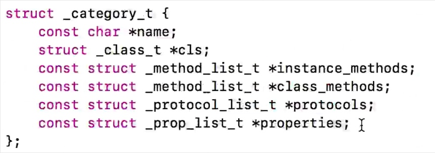
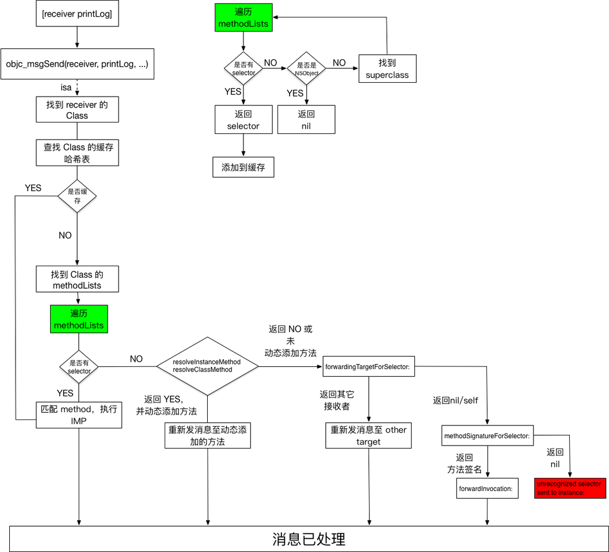
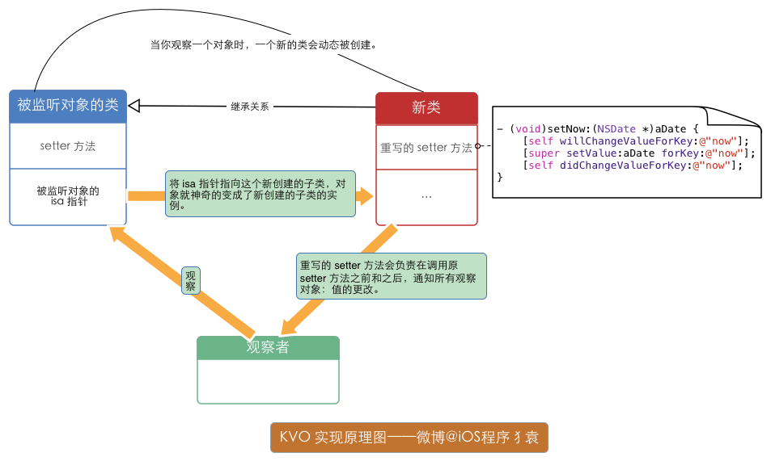

# Runtime

[toc]

Objective-C 扩展了 C 语言，并加入了面向对象特性和 Smalltalk 式的消息传递机制。而这个扩展的核心是一个用 C 和 编译语言 写的 Runtime 库。它是 Objective-C 面向对象和动态机制的基石。
OC是一门动态语言，它会将一些工作放在代码运行时才处理而并非编译时。有很多类和成员变量以及方法的实现在我们编译的时是不知道的，而是在运行时我们所编写的代码会转换成完整的确定的代码运行，这些就是需要runtime所支持的。
runtime最主要的就是消息机制，OC的代码会转成由runtime来操作。消息发送、消息转发（实现多继承）、runtime库里面包含了跟类、成员变量、方法相关的API，比如获取类里面的所有成员变量，为类动态添加成员变量，动态改变类的方法实现，为类动态添加新的方法等。

## OC 对象

### 实例对象

```
NSObject *object = [ [NSObject alloc] init];
```
储存：
- isa指针
- 成员变量具体值

底层实现（内存布局）：

```
struct NSObject_IMPL
{
	Class isa;
	// 成员变量
}
```

### 类对象

```
Class objectClass = [object class];
Class objectClass = object_getClass(object);
Class objectClass = [NSObject class];

```
储存：
- isa指针
- superclass指针
- 属性信息
- 对象方法信息
- 协议信息
- 成员变量信息

### 元类对象

```
Class objectMetaClass = object_getClass([NSObject class]);
```
储存：
- isa指针
- superClass指针
- 类方法信息


### 获取对象方式

```
Class objc_getClass(const char *aClassName)
```
- 传入字符串类名
- 返回对应的类对象

```
Class object_getClass(id obj)
```
- 传入的obj可能是instance对象、class对象、meta-class对象
- 返回值：
	如果是instance对象，返回class对象
	如果是class对象，返回meta-class对象
	如果是meta-class对象，返回NSObject（基类）的meta-class对象

```
- (Class)class
+ (Class)class
```
- 返回的就是类对象


### 关系图


### 类的实现

```
typedef struct objc_class *Class;
```

`struct objc_class` 结构体


## Category


### 编译阶段Category结构



在运行时通过runtime动态将分类的方法合并到类对象、元类对象里，编译期不会做操作。

> 分类里的对象方法都存在本类的类对象里
> 分类里的类方法都存在本类的元类对象里

#### Category加载处理过程


### 添加属性

添加属性后，分类只会添加该属性的set、get方法的声明，并不会生成成员变量、set、get方法的实现。因此，仅仅在.h中声明属性，是不会有任何编译错误的，使用属性的时候，才会引发 `unrecognized selector` 异常。
而且不能直接添加成员变量（编译不过，分类的底层结构就没有成员变量的数组）


#### 关联对象 API 来添加属性


#### Key的常见用法：


#### objc_AssociationPolicy：


#### 关联对象的原理：


## 实例对象调用方法的大致逻辑：

```
MyClass *myClass = [[MyClass alloc] init];
[myClass printLog];
```
1. 先被编译成  `((void (*)(id, SEL))(void *) objc_msgSend)(myClass, @selector(printLog));`。
2. 沿着入参 `myClass` 的 `isa` 指针，找到 `myClass` 的类对象（Class），也就是 `MyClass`。
3. 接着在 `MyClass` 的方法列表 `methodLists` 中，找到对应的 `Method`。
4. 最后找到 `Method` 中的 `IMP` 指针，执行具体实现。





## 方法交换（Method Swizzling）
* 利用 `method_exchangeImplementations` 来交换2个方法中的IMP，
* 利用 `class_replaceMethod` 来修改类，
* 利用 `method_setImplementation` 来直接设置某个方法的IMP，


## runtime如何通过selector找到对应的IMP地址？
类对象中有类方法和实例方法的列表，列表中记录着方法的名词、参数和实现，而selector本质就是方法名称，runtime通过这个方法名称就可以在列表中找到该方法对应的实现。
在寻找IMP的地址时，runtime提供了两种方法，而根据官方描述，第一种方法可能会更快一些

```
IMP class_getMethodImplementation(Class cls, SEL name);
IMP method_getImplementation(Method m)
```

对于第一种方法而言，类方法和实例方法实际上都是通过调用class_getMethodImplementation()来寻找IMP地址的，不同之处在于传入的第一个参数不同。
类方法（假设有一个类A）
 
```
class_getMethodImplementation(objc_getMetaClass("A"),@selector(methodName))
```
实例方法

```
class_getMethodImplementation([A class],@selector(methodName));
```
通过该传入的参数不同，找到不同的方法列表，方法列表中保存着下面方法的结构体，结构体中包含这方法的实现，selector本质就是方法的名称，通过该方法名称，即可在结构体中找到相应的实现。

```
struct objc_method {
    SEL method_name                                      
    char *method_types                                       
    IMP method_imp                                           
}
```

而对于第二种方法而言，传入的参数只有method，区分类方法和实例方法在于封装method的函数
类方法

```
Method class_getClassMethod(Class cls, SEL name)
```
实例方法

```
Method class_getInstanceMethod(Class cls, SEL name)
```

最后调用`IMP method_getImplementation(Method m)` 获取IMP地址


## KVO 原理

Apple 使用了 isa 混写（isa-swizzling）来实现 KVO 。当观察对象A时，KVO机制动态创建一个新的名为： `NSKVONotifying_A`的新类，该类继承自对象A的本类，且KVO为`NSKVONotifying_A`重写观察属性的`setter` 方法，`setter` 方法会负责在调用原 `setter` 方法之前和之后，通知所有观察对象属性值的更改情况。在这个过程，被观察对象的 isa 指针从指向原来的A类，被KVO机制修改为指向系统新创建的子类 `NSKVONotifying_A`类，来实现当前类属性值改变的监听。
KVO的键值观察通知依赖于 NSObject 的两个方法:`willChangeValueForKey:`和 `didChangevlueForKey:`，在存取数值的前后分别调用2个方法： 被观察属性发生改变之前，`willChangeValueForKey:`被调用，通知系统该 `keyPath` 的属性值即将变更；当改变发生后，`didChangeValueForKey:` 被调用，通知系统该 `keyPath` 的属性值已经变更；之后， `observeValueForKey:ofObject:change:context:` 也会被调用。且重写观察属性的`setter` 方法这种继承方式的注入是在运行时而不是编译时实现的。




## weak 实现原理
Runtime维护了一个weak表，用于存储指向某个对象的所有weak指针。weak表其实是一个hash（哈希）表，Key是所指对象的地址，Value是weak指针的地址（这个地址的值是所指对象的地址）数组。
1. 初始化时：runtime会调用`objc_initWeak`函数，初始化一个新的`weak`指针指向对象的地址。
2. 添加引用时：`objc_initWeak`函数会调用 `objc_storeWeak()` 函数， `objc_storeWeak()` 的作用是更新指针指向，创建对应的弱引用表。
3. 释放时，调用`clearDeallocating`函数。`clearDeallocating`函数首先根据对象地址获取所有`weak`指针地址的数组，然后遍历这个数组把其中的数据设为nil，最后把这个数组从`weak`表中删除，最后清理对象的记录。


