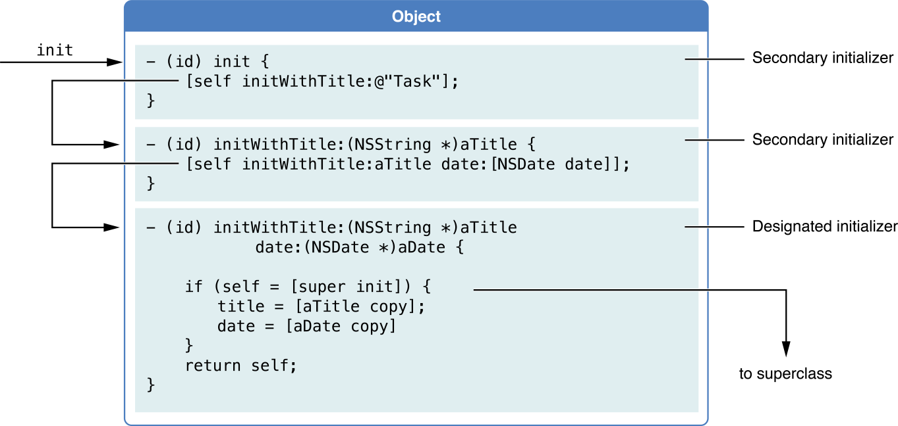
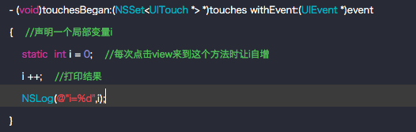
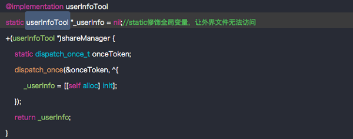

# iOS 关键字
[TOC]

## NS_DESIGNATED_INITIALIZER

对于多个 `init` 方法，苹果给出了一个调用顺序，而我们也应该遵守这种调用顺序，以确保无论外部调用者从哪个入口进入，都能够正确的初始化：



上面这张方法调用顺序，很清晰的描述了正确的初始化逻辑。
可以看到真正在进行初始化参数的，是 `initWithTitle:date:`，如果调用者通过 `init` 或者 `initWithTitle:` 进入，都应该确保变量 `title` 和 `date` 能正确赋值，所以 `init` 与 `initWithTitle:` 都通过调用 `initWithTitle:date:` 来初始化。最后 `initWithTitle:date:` 在通过父类的 `init` 初始化，并初始化两个变量。
对于这种能初始化全部必需变量的方法，一般可作为 `designed initializer`。所以，可以明确的告诉外部调用者，无论调用哪种初始化方法，最终，都会调用 `designed initializer`：


```
- (instancetype)initWithTitle:(NSString *)title date:(NSDate *)date NS_DESIGNATED_INITIALIZER;
```
一个子类如果有自己的 `designed initializer`，则必须要实现父类的 `designed initializer`。比如一个继承自 `NSObject` 的 `Person` 类，就必须要重写 `init` 方法，并在 `init` 方法中，调用自己的 `designed initializer`，而不是调用 `super` 的初始化方法。如果未实现，可以看到编译警告：

> Method override for the designed initializer of the superclass ‘- init’ not found.

所以，对于 `Person` 来说，如果 `initWithName:` 被标记了 `NS_DESIGNED_INITIALIZER`，那么实现应该为：


```
- (instancetype)init {
    // 在外部调用不需要 name 变量时，应该给出默认值
    return [self initWithName:@"John doe"];
}

- (instancetype)initWithName:(NSString *)name {
    self = [super init];
    if (self) {
        self.name = name;
    }
    return self;
}
```
除此之外，子类的 `designed initializer` 方法，在调用 `super` 时，也应该调用 `super` 的 `designed initializer`。也就是说，如果 `CustomView` 是 `UIView` 的子类，那么应该写作：


```
// 实现 UIView 的 designed initializer
- (instancetype)initWithCoder:(NSCoder *)aDecoder {
    return [self initWithVideoID:@0];
}

// 实现 UIView 的 designed initializer
- (instancetype)initWithFrame:(CGRect)frame {
    return [self initWithVideoID:@0];
}

// 实现自己的 designed initializer
- (instancetype)initWithVideoID:(NSNumber *)videoID {
    // 这里在调用 super 的初始化方法时，就不能调用 init，因为 init 不是 UIView 的 designed initializer
    self = [super initWithFrame:CGRectZero];
    if (self) {
        self.videoID = videoID;
        [self setupUI];
    }
    return self;
}

```

## NS_UNAVAILABLE

`NS_UNAVAILABLE` 的作用是直接禁用该初始化方法，简单粗暴。

假设，对于 `User` 类，如果没有 `userID` 就代表着用户无效，那么我们也没必要给 `init` 方法一个默认的 `userID = 0`，或者 `userID = nil`。此时，需要告诉调用者，就只能通过 `userID` 来初始化，那么可以写作：


```
+ (instancetype)new NS_UNAVAILABLE;
- (instancetype)init NS_UNAVAILABLE; ///< 直接标记 init 方法不可用
- (instancetype)initWithUserID:(NSNumber *)userID;
```

方法一旦标记 `NS_UNAVAILABLE`，那么在 IDE 自动补全时，就不会索引到该方法，并且如果强制调用该方法，编译器会报错（但并不代表着方法不能被调用，`runtime` 依然可以做到）。
除了可以直接使用 `NS_UNAVAILABLE` 标记不可用以外，还有一些其他的方式：


```
// 作用与 NS_UNAVAILABLE 类似
- (id) init __unavailable;
- (id) init __attribute__((unavailable));
- (id) init UNAVAILABLE_ATTRIBUTE;

// 在调用时给出提示
- (id) init __attribute__((unavailable("Must use initWithFoo: instead.")));
```

甚至是在调用时抛出异常等，比如 userID 不能小于 0：


```
- (instancetype)initWithUserID:(NSNumber *)userID {
    self = [super init];
    if (self) {
        if (userID.integerValue <= 0) {
          	// raise: 原因
            // format: 具体描述
            [NSException raise:@"error parameter" format:@"user id can not = %@", userID];
        }
        self.userID = userID;
    }
    return self;
}
```


## const

用来修饰右边的基本变量或指针变量，被修饰的变量只读，不能被修改
`const int a = 10;` 等价于 `int const a = 10;` 因为变量a被const修饰，就成为了只读，不能被修改。

```
int  const  *p   //  *p只读 ;p变量
int  * const  p  // *p变量 ; p只读
const  int   * const p //p和*p都只读
int  const  * const  p   //p和*p都只读

//定义一个全局只读变量
NSString  * const Kname = @"appkey";
```

## static

### （1）修饰局部变量
保证局部变量永远只初始化一次，在程序的运行过程中永远只有一份内存，  生命周期类似全局变量了，但是作用域不变。




### （2）修饰全局变量
使全局变量的作用域仅限于当前文件内部，即当前文件内部才能访问该全局变量。比如单例：



### （3）修饰函数
`static` 修饰函数时，被修饰的函数被称为静态函数，使得外部文件无法访问这个函数，仅本文件可以访问。这个在 `oc` 语言开发中几乎很少用。


## extern

它的作用是声明外部全局变量。这里需要特别注意`extern`只能声明，不能用于实现，而且定义和分配内存都在原来类中。

`static-const` 一个文件下使用，导入的每个文件都需要定义一份静态全局变量。
`extern-const` 只需要定义一份全局变量，多个文件共享使用。

## UIKIT_EXTERN

将函数修饰为兼容以往 `C` 编译方式的、具有 `extern` 属性(文件外可见性)、`public` 修饰的方法或变量库外仍可见的属性。

解决重复定义的问题一般会用这种方式（或者用 `static` 但是每份文件都定义，会浪费内存）

当项目需要作为一个库被外包引用的时候通常在编译时可以用参数 `-fvisibility` 指定所有符号的可见性。在编译命令中加入 `-fvisibility=hidden` 参数，会将所有默认的 `public` 的属性变为`hidden`。
如果对函数设置 `attribute((visibility ("default")))` 参数，使特定的函数仍然按默认的 `public` 属性处理，则 `-fvisibility=hidden` 参数不会对该函数起作用。
如果需要让方法或变量可以让库外被引用，就需要使用以上代码确保代码的可见性。


## @synthesize
作用于在 `@implementation` 内部，用 `@synthesiz` 声明的属性在编译的时候会自动为该属性按照固有规则生成相应的 `getter` `setter` 方法。如果有手动生成 `getter` `setter` 方法也不会报错。

```
//array是声明的属性名称，_array是编译器自动生成的成员变量。
@synthesize array = _array;
```

## @dynamic
作用于在 `@implementation` 内部，与` @synthesize` 不同，使用 `@dynamic` 声明时相当于告诉编译器 `getter` `setter` 方法由用户自己生成。如果声明为@dynamic而没有手动生成 `getter` `setter` 方法编译的时候不报错，但是在运行时如果使用 . 语法去调用该属性时会崩溃。

```
@interface TestObject()
{
   NSMutableDictionary *_dic;
}
@property (nonatomic, strong) NSMutableDictionary *dic;
@end
//不同于@ synthesize， @dynamic只需要声明属性名称即可，不需要dic = _dic把值赋值过去。但是需要自己在@interface中声明成员变量。
@dynamic dic;
```

## @property
相对于 `@dynamic` 和 `@synthesize` ，`@property` 声明的作用区域在 `@interface` 内部。它会告诉编译器自动生成 `getter` `setter` 方法。也允许用户手动生成 `getter` `setter` 中的一个方法，用 `@property` 声明的属性不能手动同时写 `getter` `setter` 方法，否则编译器会报错。
`@property` 更好的声明属性变量。因为访问方法的命名约定，可以很清晰的看出 `getter` `setter` 的用处，会传递一些额外信息，后面会跟相应的各种信息。

```
@interface TestObject()
{
   NSMutableDictionary *_dic;
}
//因为使用了 @property 声明，编译器会自动生成相应 getter setter 方法。
//使用 @property 不能手动同时生成 getter  setter 方法，编译器会报错
//readonly 表示该属性权限为仅读,那么编译器只会生成 getter 方法，不会生成 setter 方法
@property (nonatomic, strong, readonly) NSString *name;

@property (nonatomic, strong) NSMutableArray *array;

@property (nonatomic, strong) NSMutableDictionary *dic;

@end
@implementation TestObject

//如果上面的 array 使用的 @property 声明，而用户又要手动同时生成getter  setter方法
//可以使用 @synthesize 告诉编译器 该属性 getter setter 方法如果没有手动声明就自动创建，有就不自动生成。
@synthesize array = _array;

//如果dic用 @property 声明过了，会自动生成 getter  setter 方法。但是又不希望它自动生成 getter setter 方法。
//可以用 @dynamic 声明。告诉编译器 该属性的 getter  setter 方法不自动生成
//但如果要自己生成 getter setter 必须在 @interface 内部声明对应的成员变量
@dynamic dic;


- (void)setArray:(NSMutableArray *)array
{
    _array = array;
}

- (NSMutableArray *)array
{
    if (!_array) {
        _array = [NSMutableArray new];
    }
    return _array;
}
- (void)setDict:(NSMutableDictionary *)dic
{
    _dic = dic;
}

- (NSMutableDictionary *)dic
{
    if (!_dic) {
        _dic = [NSMutableDictionary new];
    }
    return _dic;
}

@end
```


## nonatomic 与 atomic

`nonatomic`(非原子性):在调用用`nonatomic`声明的对象属性时是非线程安全性的。最为直观的就是`NSMutableArray`的使用。当同时在子线程去增删数组元素，在主线程中去遍历数组元素就会出现数组越界或者数组没有遍历完。因为采用的`nonatomic`，不同操作可以同时执行，而不需要等前面的操作完成后在进行下一步操作。所以称之为非线程安全。非原子性的执行效率更高不会阻塞线程。
`atomic`(原子性):相反与非原子性，`atomic`是具有线程安全性的。他会在`get set`方法中加入线程操作。每当对用`atomic`声明的对象属性操作时，会根据操作加入线程的顺序一步一步完成操作，而不是非原子性的同时操作。执行效率较低一般来说很少用`atomic`。

## strong、weak、retain、assgin、copy、unsafe_unretained


### retain
释放旧对象，提高输入对象的引用计数`+1`，将输入对象的值赋值于旧对象，只能用户声明`OC`对象

```
@property (nonatomic, retain) Room *room;

- (void)setRoom:(Room *)room // room = r
{
    // 只有房间不同才需用release和retain
    if (_room != room) {  
        // 将以前的房间释放掉 -1,将旧对象释放
        [_room release];

        // MRC中需要手动对房间的引用计数器+1
        [room retain];

        _room = room;
    }
}
```

### strong
强引用,它是`ARC`特有。在`MRC`时代没有，相当于`retain`。由于`MRC`时代是靠引用计数器来管理对象什么时候被销毁所以用`retain`，而`ARC`时代管理对象的销毁是有系统自动判断，判断的依据就是该对象是否有强引用对象。如果对象没有被任何地方强引用就会被销毁。所以在ARC时代基本都用的`strong`来声明代替了`retain`。只能用于声明`OC`对象(`ARC`特有)。
苹果官网对`strong`的解释代码:
> Precondition:object is a valid pointer to a __strong object which is adequately aligned for a pointer. value is null or a pointer to a valid object.

> Performs the complete sequence for assigning to a __strong object of non-block type [[*]]. Equivalent to the following code:

> void objc_storeStrong(id *object, id value) {
>   id oldValue = *object;
>   value = [value retain];
>   *object = value;
>   [oldValue release];
> }

### assgin
简单的赋值操作，不会更改引用计数，用于基本的数据类型声明。

### weak
弱引用，表示该属性是一种“非拥有关系”。为这种属性设置新值时既不会保留新值也不会释放旧值，类似于`assgin`。 然而在对象被摧毁时，属性也会被清空（置 nil）。这样可以有效的防止崩溃(因为OC中给没有对象地址的指针发送消息不会崩溃，而给有内存地址但地址中是空对象的指针发消息会崩溃，野指针)，该声明必须作用于OC对象。
对于 weak 对象会放入一个 `hash` 表中。用 `weak` 指向的对象内存地址作为 `key`，当此对象的引用计数为`0`的时候会 `dealloc`，假如 `weak` 指向的对象内存地址是`a`，那么就会以`a`为键， 在这个 `weak` 表中搜索，找到所有以`a`为键的 `weak` 对象，从而设置为 `nil`。
(`ARC`特有),`strong` 和 `weak`的指针，根本区别在于，`strong`执行了`retain`操作，而`weak`没有。


### copy
不同于其他声明，`copy`会根据声明的属性是否是可变类型而进行不同操作。如果对象是一个不可变对象，例如`NSArray` `NSString` 等，那么`copy`等同于`retain`、`strong`。如果对象是一个可变对象，例如:`NSMutableArray`,`NSMutableString`等，它会在内存中重新开辟了一个新的内存空间,用来 存储新的对象,和原来的对象是两个不同的地址,引用计数分别为`1`。这就是所谓的深拷贝浅拷贝，浅拷贝只是`copy`了对象的内存地址，而深拷贝是重新在内存中开辟新空间，新空间对象值与拷贝对象的值一样。但是是完全不同的两个内存地址。
例如`copy`修饰的类型为 `NSString`不可变对象时，`copy`可以保护其封装性，当赋值对象是一个 `NSMutableString` 类时(`NSMutableString`是 `NSString` 的子类，表示一种可修改其值的字符串），此时若是不用`copy`修饰拷贝字符串，那么赋值该对象之后，赋值对象字符串的值就可能会在其他地方被修改，修改后赋值后对象也会改变，造成值不对。所以，这时就要拷贝一份“不可变”的字符串，确保对象中的字符串值不会无意间变动。只要实现属性所用的对象是“可变的” ，就应该在设置新属性值时拷贝一份。


### __weak
主要用于解决循环引用，用`__weak`修饰的变量 当对象释放后，指针自动设置为`nil`，当后面继续使用该指针变量的时候不会造成`crash`，更不会造成强引用使该释放的对象无法释放，造成内存泄露。

```
__weak typeof(self) weakSelf = self;
```

### __strong
相反与`__weak`,主要用于当使用某个对象是，希望它没有提前被释放。强引用该对象使其无法释放。例如在`block`内部，希望`block`调用时该对象不会被提前释放造成错误。可以使用强引用。

### 补充
`ARC` 下不显式指定任何属性关键字时默认的关键字
基本数据： `atomic`, `readwrite`, `assign`
普通的 `OC` 对象: `atomic`, `readwrite`, `strong`


