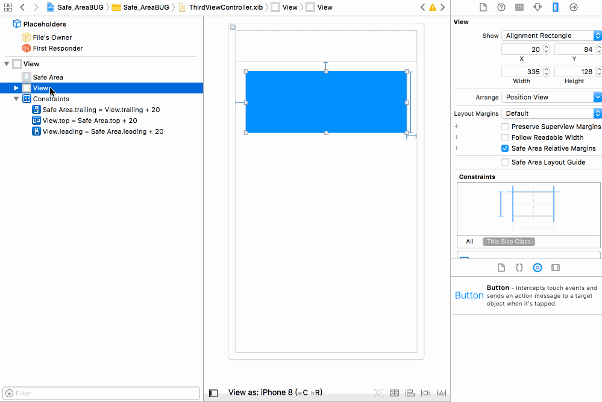
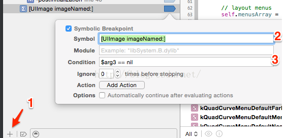

# 开发遇到的一些问题及解决方案（二）


## UIPickerView 获取当前选中行 didselect 方法去设置会有延迟

```
- (NSInteger)selectedRowInComponent:(NSInteger)component; // returns selected row. -1 if nothing selected
```

## iOS 11 之前 xib 的 SafeArea 计算位置不一致的解决方法
1.多添加一个距离SuperView的约束
2.设置这个约束为 >= 距离
3.设置距离Safe Area的约束优先级比距离SuperView约束优先级低。（比如750）




## 循环动画以及动画移除

```
    [UIView animateWithDuration:2 delay:0 options:(UIViewAnimationOptionRepeat) animations:^{
        self.lineView.frame = end;
    } completion:^(BOOL finished) {
        self.lineView.frame = start;
    }];

    [self.lineView.layer removeAllAnimations];
```


## 设置状态栏字体
启动时的颜色是在 info.plist 中添加以下项为白色字体


Viewcontroller 中的设置有两种
简单的是：
在 info.plist 中 添加


然后设置 
```
[[UIApplication sharedApplication] setStatusBarStyle:UIStatusBarStyleLightContent]；
```


## 解决CUICatalog: Invalid asset name supplied问题
添加一个系统断点，来判断图片名字是否为 nil 或者 @"" 



## 输入框限制小数点后两位 以及只能输入数字和点

```
- (BOOL)textField:(UITextField *)textField shouldChangeCharactersInRange:(NSRange)range replacementString:(NSString *)string{
    

    BOOL res = YES;
    NSCharacterSet* tmpSet = [NSCharacterSet characterSetWithCharactersInString:@"0123456789."];
    int i = 0;
    while (i < number.length) {
        NSString * string = [number substringWithRange:NSMakeRange(i, 1)];
        NSRange range = [string rangeOfCharacterFromSet:tmpSet];
        if (range.length == 0) {
            res = NO;
            break;
        }
        i++;
    }
    if (!res) {
	return NO;
     }


    
    //如果输入的是“.”  判断之前已经有"."或者字符串为空
    if ([string isEqualToString:@"."] && ([textField.text rangeOfString:@"."].location != NSNotFound || [textField.text isEqualToString:@""])) {
        return NO;
    }
    //拼出输入完成的str,判断str的长度大于等于“.”的位置＋4,则返回false,此次插入string失败 （"379132.424",长度10,"."的位置6, 10>=6+4）
    NSMutableString *str = [[NSMutableString alloc] initWithString:textField.text];
    [str insertString:string atIndex:range.location];
    if (str.length >= [str rangeOfString:@"."].location+4){
        return NO;
    }
    return YES;
}
```


## Safari’s features
    
```
    SFSafariViewController *safariVC = [[SFSafariViewController alloc] initWithURL:url];
    [self presentViewController:safariVC animated:YES completion:nil];
```


## AVCaptureDevice 闪光灯/手电筒


```AVCaptureDevice *device = [AVCaptureDevice defaultDeviceWithMediaType:AVMediaTypeVideo];
  //手电筒配置
 if ([device hasTorch]) {
    [device lockForConfiguration:nil];
    device.torchMode = AVCaptureTorchModeAuto;
    [device unlockForConfiguration];
 }

// 切换开关时 可以使用 torchActive 判断是否打开，torchLevel 在5s上变为 1 之后就一直是 1，所以不用这个属性去判断
AVCaptureDevice *device = [AVCaptureDevice defaultDeviceWithMediaType:AVMediaTypeVideo];
    NSError *error = nil;
    if ([device hasTorch]) {
        BOOL locked = [device lockForConfiguration:&error];
        if (locked) {
            if (device.torchActive) {
                device.torchMode = AVCaptureTorchModeOff;
            } else {
                device.torchMode = AVCaptureTorchModeOn;
            }
            [device unlockForConfiguration];
        }
    }
```


##  解决Capture View Hierarchy不显示的问题
 
 添加下面两行代码
```
- (void)_firstBaselineOffsetFromTop {
    
}
- (void)_baselineOffsetFromBottom {
    
}
```


## 文字渐变实现方式之一

```
label.textColor = [UIColor colorWithPatternImage:[UIImage imageNamed:@“color”]];
```


